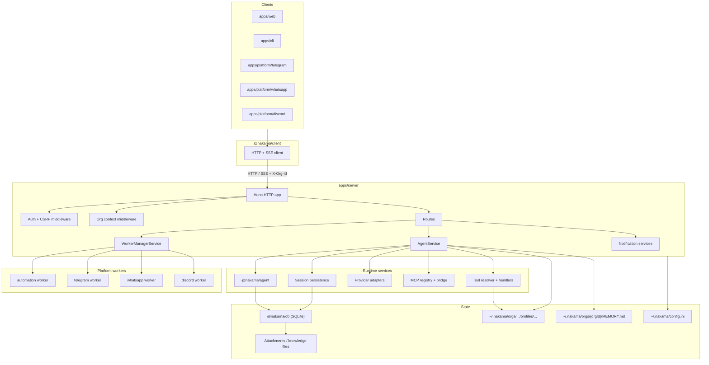

# Nakama Architecture

Nakama is an agent platform for teams. The platform does not replace the team. One shared server runtime serves thin clients.

The org is the isolation boundary. Profiles, sessions, tools, MCP, skills, automations, attachments, and usage are org-scoped unless they are platform-level.

## System overview



Apps can import from `packages/*`. Packages must not import from `apps/*`.

## Repo map

```text
nakama/
├── apps/
│   ├── server/                 # HTTP API, auth, org, agent runtime
│   ├── web/                    # Dashboard
│   ├── cli/                    # Terminal client
│   └── platform/{automation,telegram,whatsapp,discord}/
├── packages/
│   ├── agent/                  # Prompt assembly, tool loop, chat session
│   ├── core/                   # Contracts, soul, config, builtin tools
│   ├── db/                     # SQLite schema, adapters, migrations
│   └── client/                 # Shared HTTP/SSE client
└── docs/website/
```

## Boundaries

| Layer | Duty |
|---|---|
| Clients (`web`, `cli`, channels) | Thin HTTP and SSE client. This layer has no agent loop. |
| `apps/server` `AgentService` | Assembles the profile, provider, tools, MCP, soul, Composio, org-memory, attachments, and persistence. |
| `packages/agent` | This package owns prompts, the tool loop, compaction, and `AgentChatSession`. |
| `packages/core` | This package owns contracts, soul compose, builtins, channel helpers, and config. |
| `packages/db` | This package owns the schema and adapters for persisted entities. |

## HTTP

The entrypoint is [`apps/server/src/http/app.ts`](./apps/server/src/http/app.ts).

The HTTP app does these steps in this order:

1. The app serves static web assets if `webDistDir` is set.
2. The app applies auth and CSRF middleware.
3. Internal routes for automation, curator, notification webhooks, and Composio OAuth run before org middleware.
4. Org middleware reads `X-Org-Id` or `active_org_id`. The middleware sets membership and `orgRole`.
5. Routes call services.
6. The same Hono registration produces `/openapi.json`.

These route groups run before org middleware: `internal-automations`, `internal-curator`, `notification-webhooks`, Composio OAuth.

These route groups run after org middleware: `system`, `auth`, `setup-import`, `workers`, `models`, `user-context`, `sessions`, `profiles`, `profile-portability`, `artifact-shares`, `mcp`, `skills`, `tools`, `automations`, `notification-destinations`, `token-optimization`, `coding-harnesses`, `composio`, `platform-orgs`, `data-portability`, `org-members`, `org-memory`, `org-curator`, `skill-proposals`, `skill-suggestions`.

## Multi-tenancy

Each authenticated request that is not a platform request needs an active org. The client sends `X-Org-Id` or the cookie `active_org_id`.

Org roles are `admin`, `member`, and `viewer`. A platform admin uses `/v1/platform/*`.

- [`org-middleware.ts`](./apps/server/src/http/org-middleware.ts)
- [`org-guards.ts`](./apps/server/src/http/org-guards.ts)
- [`org-service.ts`](./apps/server/src/services/org-service.ts)

## Agent runtime

`AgentService` in [`agent-service.ts`](./apps/server/src/services/agent-service.ts) assembles the agent runtime.

The service loads the profile, the soul, the provider, and the model. The service attaches builtin tools, custom JS tools, custom Python tools, and MCP tools. The service attaches Composio tools and org-memory tools when they apply. Super Bot gets extra tools when the profile permits them. The service also attaches questionnaire, todo, and attachments. Discord sessions get Discord artifact tools.

Prompt layers:

1. [`soul/compose.ts`](./packages/core/src/soul/compose.ts) supplies soul content.
2. [`skills/compose.ts`](./packages/core/src/skills/compose.ts) supplies the skills catalog and agent-browser text.
3. The service adds org memory from `~/.nakama/orgs/{orgId}/MEMORY.md` for roles that are not `viewer`.
4. [`chat-prompt.ts`](./packages/agent/src/chat-prompt.ts) supplies structure and tool instructions.
5. [`chat.ts`](./packages/agent/src/chat.ts) generates the per-turn reply.

Per-turn context can include todos, matched skills, and Composio connections. A knowledge-base catalog can also attach to the system prompt.

## Sessions

- Live state is the in-memory `AgentChatSession`.
- Durable history is SQLite `session_messages` through [`session-persistence.ts`](./apps/server/src/services/session-persistence.ts).
- Questionnaire and todo are on `sessions` metadata.
- The tables are `sessions`, `session_messages`, and `attachments`.

## Tools and MCP

| Kind | Where |
|---|---|
| Builtin definitions | `packages/core/src/tools/*` |
| Server runtime tools | `apps/server/src/tools/*` |
| Custom JS | `javascript-tool-loader.ts` |
| Custom Python | `python-tool-loader.ts` |
| MCP | `mcp-tool-bridge.ts` |
| Composio | `composio-tool-bridge.ts` |

Tools are profile-scoped. Super Bot can get extra runtime tools when the profile permits them.

## Workers and automations

The server starts workers with PM2 through [`worker-manager-service.ts`](./apps/server/src/services/worker-manager-service.ts).

- `apps/platform/automation` does scheduled work and skill-curator ticks.
- `apps/platform/telegram`, `whatsapp`, and `discord` are channel bridges.

The database stores automations in `automations` and `automation_runs`.

The services are `automation-service.ts` and `automation-runner.ts`.

## Notifications and attachments

Destinations and inbound webhooks use `notification-destination-service.ts` and `notification-webhook-service.ts`.

Attachments have SQLite records and files on disk. The server adds them to provider messages through `attachment-service.ts`.

## CLI terminal UI

| File | Purpose |
|---|---|
| `terminal-renderer.ts` | Composer, transcript, stream, and status rules |
| `terminal-layout.ts` | Viewport, pinned input, stream buffer, and frame diff |
| `virtual-message-list.ts` | Transcript wrap and spacing |
| `terminal-frame.ts` | Frame diff and cursor |

`PersistentPrompt` calls `TerminalRenderer.buildComposerLines()`. `TerminalLayout` reserves composer rows. The transcript uses `beginMessage`, `writelnScroll`, and `endMessage`. The stream writes to `streamBuffer`. `endStream()` seals the stream.

Spacing has layers. User-bubble padding, composer padding, and inter-message gaps are different. `shouldInsertLeadingGap` adds a gap before a message. `endStream()` adds a gap after the stream.

## Persistence

The schema is [`packages/db/sql/schema.sql`](./packages/db/sql/schema.sql).

| Area | Tables |
|---|---|
| Tenant / auth | `organizations`, `users`, `org_members`, `org_invites`, `browser_sessions`, `channel_org_mappings` |
| Agent config | `profiles`, `tools`, `profile_tools`, `skills`, `profile_skills`, `profile_skill_usage`, `mcp_servers`, `profile_mcp_servers` |
| Runtime | `sessions`, `session_messages`, `attachments`, `artifact_shares` |
| Execution | `automations`, `automation_runs`, `automation_run_read_state` |
| Approvals | `org_memory_proposals`, `skill_proposals`, `skill_suggestions` |
| Composio | `composio_toolkits`, `profile_composio_toolkits`, `composio_user_connections` |
| Notifications | `notification_destinations` |
| Analytics / config | `llm_usage_stats`, `llm_usage_model_stats`, `workspace_settings` |

Org memory is also on disk at `~/.nakama/orgs/{orgId}/MEMORY.md`.

## Invariants

- Packages must not import from `apps/*`.
- The server examines org membership before org-scoped routes.
- Profiles control behavior and tool availability.
- Message history is durable. History is not only in process memory.
- The same Hono app produces OpenAPI and serves runtime requests.
- Channel apps are transport bridges. They are not separate agent runtimes.
- PM2 is optional. PM2 is the intended path to start workers.
